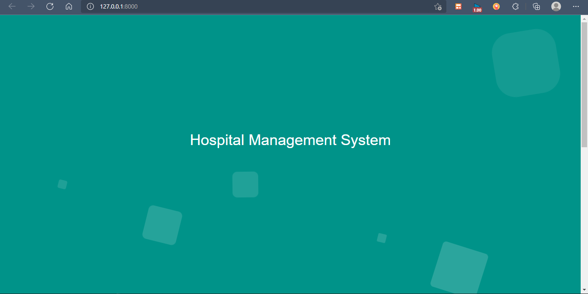
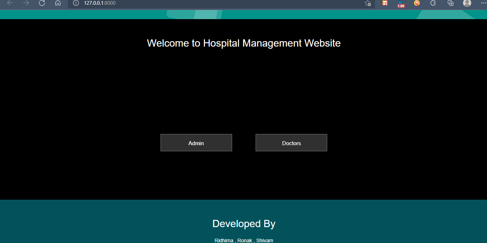
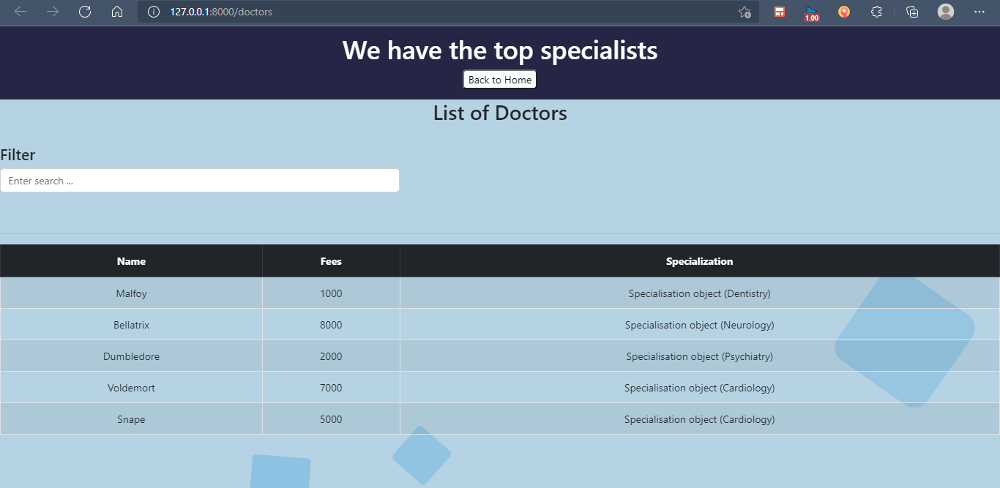
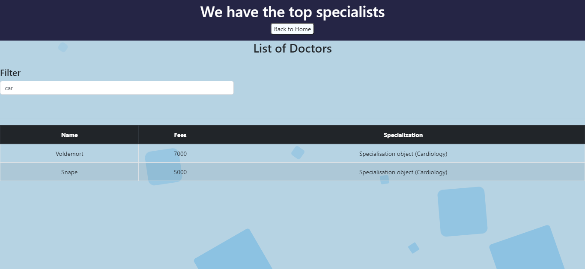
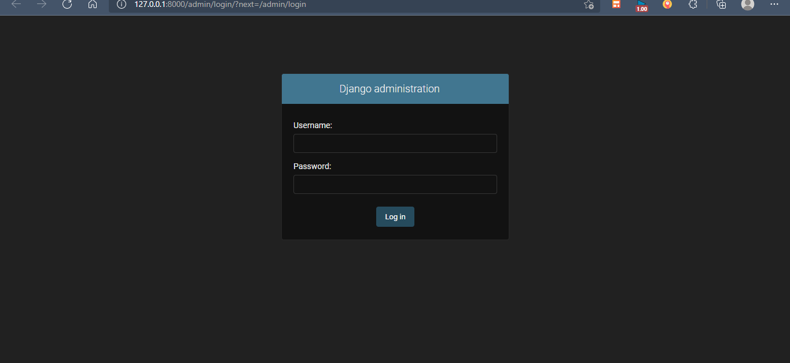
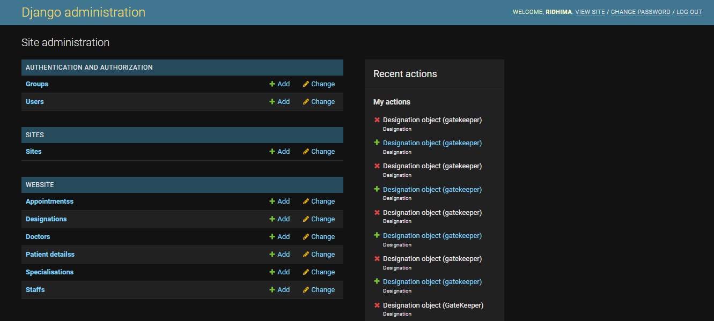

# Hospital-Management 🏥
This repository contains project for Database Systems Course ( 5th Semester )

Features :
- Check list of doctors
- Filter doctors according to Name , Fees , Specialisation
- For admin : View database values , add , delete , modify data 

# Report 📃

Link to report : [Report](https://drive.google.com/file/d/1k0hJFkX-mxh0y6pXeI_k9mVGQn_6Ky5M/view?usp=sharing)

# Requirements 🛠️

- MYSQL Client
- XAMPP
- Django

# Connect Django To already existing database in XAMPP 🖇️

- Install MysqlClient
- Run XAMPP Server
- Make changes in DATABASES of settings.py as mentioned in code
- On terminal , run the command `python manage.py inspectdb > models.py` in a folder different from the actual models.py 
- Now copy the models formed in the new models.py to original
- Run `python manage.py makemigrations`
- Run `python manage.py migrate`
- Create superuser 
- Run the project with runserver command and if there are no errors , the XAMPP database is connected successfully

# How to run ▶️

For Django Website
1. Clone the repository 
2. Set up database at XAMPP ( Here the database has values as shown in report )
3. Go to settings.py and change the username password accordingly
4. Go to Hospital folder
5. Run XAMPP Server
6. Type `python manage.py runserver`
7. Go to localhost address and the website is displayed

# Screenshots 🖼️

